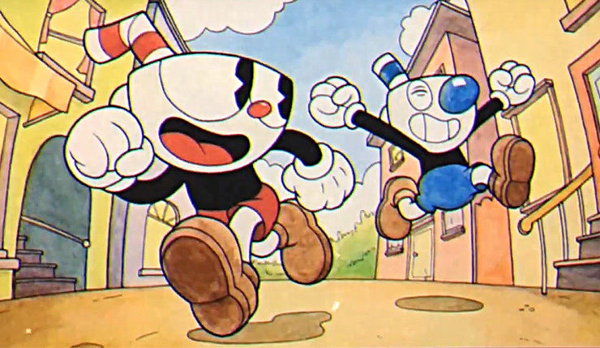

# Style Transfer 
Sreenya Chitluri - Report

## Implementation details
We used a pretrained model VGG16 model which was first initialized by the ImageNet weights and was finetuned using the MS COCO dataset.  
  
VGG16 is a deep convolutional neural network architecture primarily used for image classification tasks. 

The architecture we have is a modified version of the same. It has additional convolution layers which help in the special task of image style transformation. VGG16 is a more broad model that can be used for various image related tasks. 

``TransformerNet Architecture used -`` 
1. Initial Convolutional Block:  
    **Input:** 3 channels (presumably RGB image)  
    **Output:** 32 channels  
    **Kernel size:** 9x9, Stride: 1  

2. Convolutional Block with Down-sampling (1st Down-sampling Block):  

    **Input:** 32 channels  
    **Output:** 64 channels  
    **Kernel size:** 3x3, Stride: 2  
3. Convolutional Block with Down-sampling (2nd Down-sampling Block):  

    **Input:** 64 channels  
    **Output:** 128 channels  
    **Kernel size:** 3x3, Stride: 2  
4. Five Residual Blocks:  

    Each residual block likely consists of two convolutional layers with a small kernel size (e.g., 3x3) and rectified linear unit (ReLU) activations.
    These residual blocks are designed to capture and preserve important features during training.
5. Convolutional Block with Up-sampling (1st Up-sampling Block):  

    **Input:** 128 channels  
    **Output:** 64 channels  
    **Kernel size:** 3x3, Up-sampling  
6. Convolutional Block with Up-sampling (2nd Up-sampling Block):  

    **Input:** 64 channels  
    **Output:** 32 channels  
    **Kernel size:** 3x3, Up-sampling  
7. Final Convolutional Block:  

    **Input:** 32 channels  
    **Output:** 3 channels  
    **Kernel size:** 9x9, Stride: 1  
    
No normalization and ReLU activation are applied.

``Algorithm - ``
1. Read an image file (img) using Image.open() and apply a transformation using transform. Convert the transformed image to a PyTorch variable and move it to the GPU if available.

2. Prepare the image for model inference by adding a dimension to it. 

3. Disable gradient computation.

4. Apply the transformer to the image tensor, denormalize the output, and move it to the CPU.

## Testing results
Given image

Reference image

Stylized image

